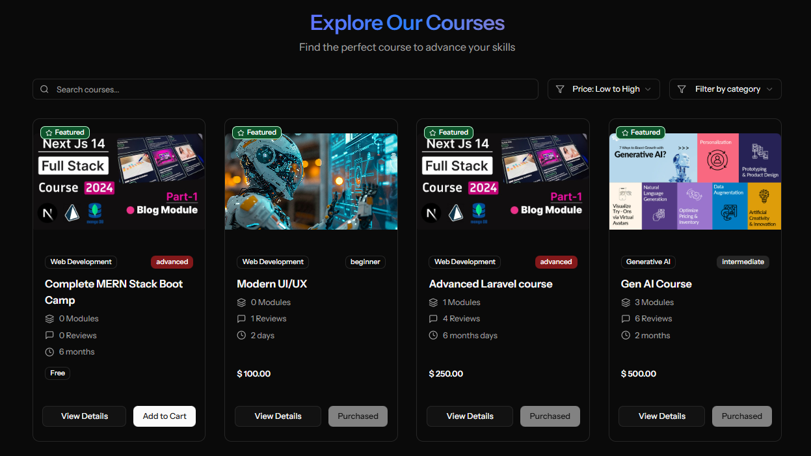
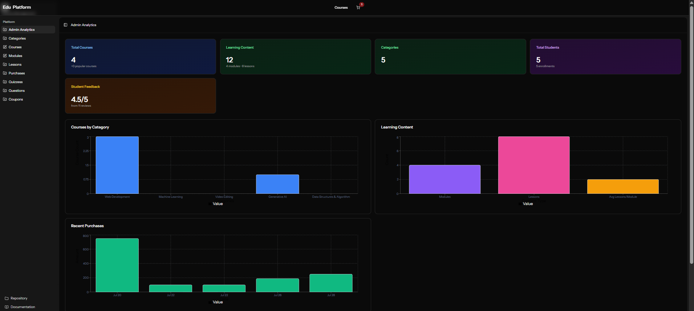
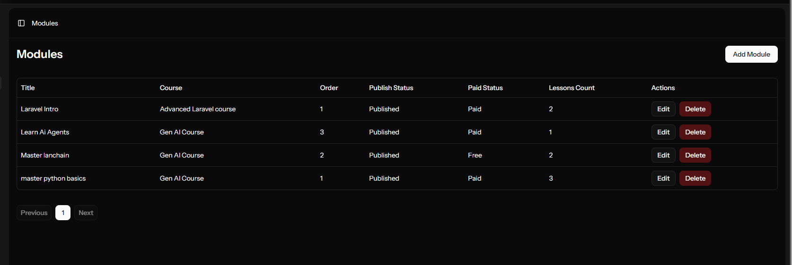
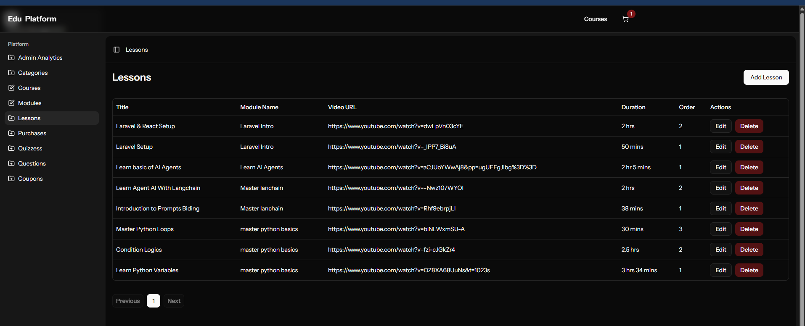
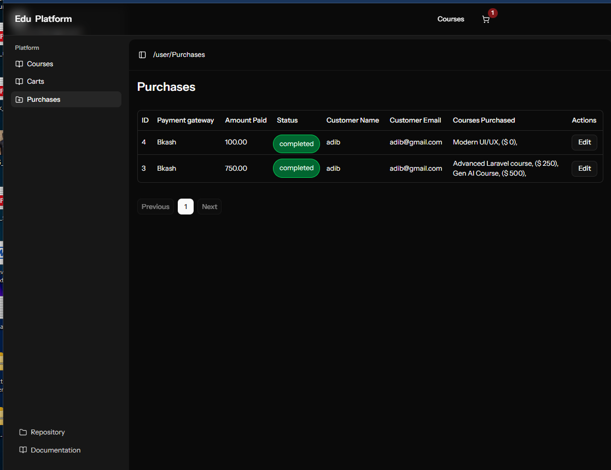
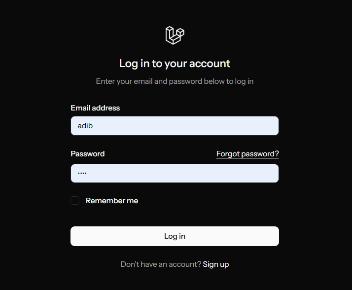

<div align="center">

  

  <br />

  # 🎓 EduPlatform - Advanced Micro-Learning System
  
  **The Next-Gen LMS built with Laravel 12, React 19 & MySQL**

  <p>
    <a href="#">
      
    </a>
    <a href="#">
      
    </a>
  </p>

  <p>
    
    
    
    
    
  </p>
</div>

---

## 📖 Overview

**EduPlatform** is a robust, full-stack Learning Management System (LMS) designed for the modern web. Built on the cutting-edge **Laravel 12** framework and **React 19**, it utilizes a **Service-Controller** architecture to ensure clean, maintainable, and scalable code.

This platform bridges the gap between administrators and learners. It offers a powerful **Admin Dashboard** for managing content (courses, modules, lessons), finances (coupons, orders), and users, while providing students with an immersive, distraction-free **Learning Environment** complete with video playback, progress tracking, and assessments.

---

## ✨ Key Features

### 🏢 For Administrators
* **Comprehensive Analytics:** Real-time dashboard tracking revenue, enrollments, and student feedback.
* **Content Management:** Granular control over Categories, Courses, Modules, and Lessons.
* **Marketing Tools:** Robust coupon system with validity dates and usage limits.
* **Order Management:** Full visibility into transaction history and payment statuses.
* **Assignments & Quizzes:** Create MCQ tests and assignments to evaluate student progress.

### 👨‍🎓 For Students
* **Immersive Learning Player:** Distraction-free video playback with nested module navigation.
* **Progress Tracking:** Visual indicators of course completion and continuous learning flow.
* **Interactive Assessments:** Take quizzes and submit assignments directly within the platform.
* **Smart Search & Filtering:** Find courses easily by category, price, or difficulty level.
* **Review System:** Rate and review courses to help the community.

### 🛠️ Technical Highlights
* **Architecture:** Clean **Service-Controller-Repository** pattern for best practices.
* **Frontend:** Built with **React 19** and **TypeScript** for type-safe, reactive UI.
* **Design:** Polished with **Tailwind CSS** and **Shadcn UI** for a modern aesthetic.
* **Performance:** Optimized database queries and server-side logic.

---

## 📸 Visual Tour

### 1. Powerful Admin Analytics
A centralized hub for platform oversight. Monitor total courses, student enrollments, and revenue trends through interactive charts.

<br/>

### 2. Powerful Admin Analytics
A centralized hub for platform oversight. Monitor total courses, student enrollments, and revenue trends through interactive charts.

<br/>

### 3. Immersive Video Learning Experience
The core of the student experience. A side-by-side video player with a collapsible curriculum tree (Modules > Lessons), allowing students to track progress seamlessly.

<br/>

### 4. Course Catalog & Discovery
A dynamic grid layout featuring search, categorization, and advanced filtering. Includes "Featured" badges and pricing indicators.

<br/>

### 5. Dynamic Course Details
A conversion-optimized landing page for every course. Shows curriculum preview, instructor details, pricing, and allows users to apply **Coupon Codes** before purchase.

<br/>

### 6. Advanced Content Management
#### Module Management
Drag-and-drop or list-based management of course modules with paid/free status toggles.


#### Lesson Curation
Add video URLs, descriptions, and duration for specific lessons within modules.

<br/>

### 7. Marketing & Sales
#### Coupon System
Create discount codes (percentage or fixed amount) with expiry dates to drive sales.


#### Order Control
View all transactions, payment gateways used (e.g., Bkash), and verify payment statuses.

<br/>

### 8. Secure Authentication
A clean, secure login interface for students and admins, supporting "Remember Me" functionality.


---

## 🧰 Tech Stack

| Domain | Technology |
| :--- | :--- |
| **Backend Framework** | Laravel 12 |
| **Frontend Library** | React 19 |
| **Language** | PHP 8.3+, TypeScript |
| **Database** | MySQL |
| **Styling** | Tailwind CSS, Shadcn UI |
| **State Management** | React Context / Hooks |
| **Authentication** | Laravel Sanctum / Breeze |

---

## 🚀 Getting Started

Follow these steps to set up the project locally.

### Prerequisites
* PHP 8.2 or higher
* Composer
* Node.js & npm
* MySQL

### Installation

1.  **Clone the repository**
    ```bash
    git clone [https://github.com/yourusername/edu-platform.git](https://github.com/yourusername/edu-platform.git)
    cd edu-platform
    ```

2.  **Install Backend Dependencies**
    ```bash
    composer install
    ```

3.  **Setup Environment**
    ```bash
    cp .env.example .env
    php artisan key:generate
    ```
    *Configure your MySQL database credentials in the `.env` file.*

4.  **Migrate & Seed Database**
    ```bash
    php artisan migrate --seed
    ```

5.  **Install Frontend Dependencies**
    ```bash
    npm install
    ```

6.  **Run Development Servers**
    * Terminal 1 (Laravel):
        ```bash
        php artisan serve
        ```
    * Terminal 2 (Vite/React):
        ```bash
        npm run dev
        ```

7.  **Access the App**
    Visit [http://localhost:8000](http://localhost:8000)

---

## 🤝 Contributing

We welcome contributions! Please see the `CONTRIBUTING.md` file for guidelines on how to submit issues and pull requests.

---

## 📝 License

This project is open-sourced software licensed under the [MIT license](https://opensource.org/licenses/MIT).

---

<div align="center">
  <p>Built with ❤️ for the Developer Community</p>
</div>
